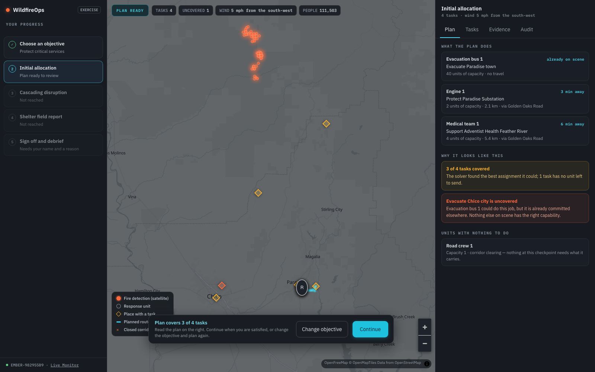

# Ryan Xing

Computer science at Vanderbilt. I build full-stack products, AI systems, developer tools, and mobile software.

Currently researching how coding agents explain decisions to developers. Open to Summer 2027 software engineering internships.

[Portfolio](https://ryansxing.com) · [LinkedIn](https://www.linkedin.com/in/ryan-xing) · [Email](mailto:ryanxing06@gmail.com) · [Résumé](https://ryansxing.com/resume.pdf)

## Selected work

**[WildfireOps](https://github.com/RyanSXing/wildfire-operation-planner)** — Replayable wildfire decision-support simulation for incident ranking, closure-aware routing, and auditable crew allocation. `Python` `FastAPI` `React` `PostGIS` `OR-Tools`

**[Code Trace Studio](https://github.com/RyanSXing/CodeTrace-Studio)** — Browser IDE that makes parsing, AST construction, and program execution visible step by step. `Python` `Flask` `React` `PLY`

**[Peptide Tracker](https://github.com/RyanSXing/peptide-tracker)** — Offline-first SwiftUI app for protocols, inventory, reminders, and pharmacokinetic concentration modeling. `Swift` `SwiftUI` `Firebase`

**[Agentic Workflow Platform](https://github.com/RyanSXing/agentic-workflow-platform)** — Governed multi-agent evaluation with typed handoffs, privacy controls, audit trails, and regression gates. `Python` `LangGraph` `FastAPI` `PostgreSQL` `React`

## Toolkit

  &nbsp;&nbsp;
  &nbsp;&nbsp;
  &nbsp;&nbsp;
  &nbsp;&nbsp;
  &nbsp;&nbsp;
  &nbsp;&nbsp;
  &nbsp;&nbsp;
  

<strong>Languages:</strong> Python, TypeScript, JavaScript, Swift, Java, SQL <strong>Frameworks and systems:</strong> React, Next.js, FastAPI, React Native, PyTorch, PostgreSQL, Docker

